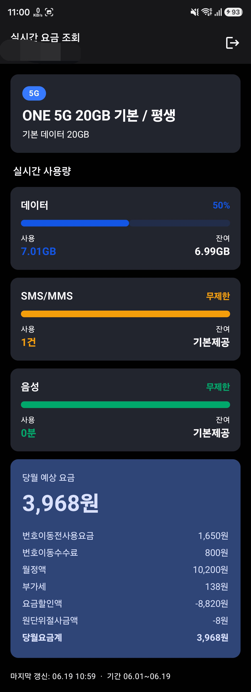
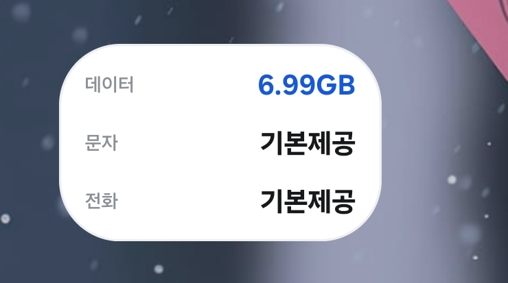

# 더원요금조회

**더원모바일**(theonem.co.kr) 알뜰폰 가입자를 위한 비공식 Android 앱입니다. 
<br>셀프케어 웹사이트에 로그인해 **실시간 데이터·음성·문자 사용량**과 **당월 예상 요금**을 한눈에 보여주고, 홈 화면 **위젯**으로 잔여량을 상시 확인할 수 있습니다.
<br> 요즘시대에 공식앱이 없다는건 좀...

<table>
  <tr>
    <td align="center"><b>앱 메인</b></td>
    <td align="center"><b>홈 위젯</b></td>
  </tr>
  <tr>
    <td></td>
    <td></td>
  </tr>
</table>

## 다운로드

빌드 없이 바로 설치하려면 아래 APK를 받으세요. (디버그 빌드)

**▶ [app-debug.apk 다운로드](https://github.com/lunaStratos/theonemobile/raw/main/apk/app-debug.apk)** (약 24MB)

> 설치 방법
> 1. 안드로이드 기기에서 위 링크로 APK를 내려받습니다.
> 2. 설치 시 "출처를 알 수 없는 앱" 경고가 뜨면 **설정 → 이 출처 허용**을 켜고 진행합니다.
> 3. 디버그 서명 빌드이므로 Play 프로텍트 경고가 표시될 수 있습니다. 직접 설치하는 경우 무시해도 됩니다.

## 주요 기능

- **실시간 사용량 조회** — 데이터 / SMS·MMS / 음성의 사용량·잔여량을 진행률 바와 함께 표시 (무제한 항목 별도 표기)
- **당월 예상 요금** — 월정액·부가세·할인액 등 청구 항목별 상세 내역과 합계
- **요금제 정보** — 가입 요금제명, 네트워크(5G/LTE), 기본 데이터 제공량
- **자동 로그인** — 자격증명을 기기에 암호화 저장해 재실행 시 자동 인증
- **홈 화면 위젯** — 1x1 / 1x2 / 1x4 3종 크기, 데이터·문자·전화 잔여량 표시, 탭으로 즉시 새로고침
- **백그라운드 갱신** — WorkManager로 30분 주기 위젯 자동 업데이트, 마지막 조회값은 캐시되어 오프라인에서도 표시

## 기술 스택

| 영역 | 사용 기술 |
|------|-----------|
| 언어 | Kotlin 2.2 |
| UI | Jetpack Compose (Material 3) |
| 위젯 | Glance for App Widgets |
| 네트워크 | OkHttp 4 + 영속 CookieJar |
| 직렬화 | kotlinx.serialization (JSON) |
| 비동기 | Kotlin Coroutines |
| 백그라운드 | WorkManager |
| 보안 저장소 | androidx.security EncryptedSharedPreferences (실패 시 일반 SharedPreferences 폴백) |
| 빌드 | Android Gradle Plugin 9.2 / Gradle 9.4, Version Catalog |

- `namespace` / `applicationId`: `com.lunastratos.theone`
- `minSdk` 24, `targetSdk`/`compileSdk` 36

## 프로젝트 구조

```
app/src/main/java/com/lunastratos/theone/
├─ MainActivity.kt              # 진입점 — 로그인 상태에 따라 Login/Dashboard 분기
├─ ui/
│  ├─ MainViewModel.kt          # 로그인·새로고침·로그아웃 상태 관리
│  ├─ login/LoginScreen.kt      # 로그인 화면
│  ├─ dashboard/DashboardScreen.kt  # 사용량·요금 대시보드
│  └─ theme/Theme.kt            # 브랜드 컬러 / Compose 테마
├─ data/
│  ├─ UsageRepository.kt        # 단일 진입점 — 3개 엔드포인트 병렬 조회 후 Dashboard 합성
│  ├─ AuthStore.kt              # 자격증명·세션 쿠키 암호화 저장
│  ├─ SnapshotStore.kt          # 마지막 대시보드 스냅샷 캐시
│  ├─ model/                    # Dashboard 도메인 모델 + API 응답 모델 + Mapper
│  └─ remote/
│     ├─ TheOneApi.kt           # 셀프케어 API 클라이언트
│     └─ PersistentCookieJar.kt # 쿠키 영속화
└─ widget/
   ├─ SmallUsageWidget.kt / MediumUsageWidget.kt / WideUsageWidget.kt
   ├─ WidgetReceivers.kt        # AppWidget 리시버
   ├─ WidgetDesign.kt           # 위젯 공통 디자인 시스템
   ├─ UsageWorker.kt            # WorkManager 갱신 작업
   ├─ UsageWidgetScheduler.kt   # 주기/즉시 갱신 스케줄링
   └─ RefreshAction.kt          # 위젯 새로고침 액션
```

### 데이터 흐름

```
LoginScreen ──▶ MainViewModel ──▶ UsageRepository ──▶ TheOneApi (OkHttp)
                                        │                    │
                                        │            theonem.co.kr 셀프케어
                                        ▼
                          가입정보 · 실시간 사용량 · 실시간 요금 (병렬 조회)
                                        │
                              DashboardMapper (웹 표시 로직 이식)
                                        ▼
                            Dashboard ──▶ DashboardScreen / 위젯
```

## API / 인증 동작

더원모바일은 별도 공개 API가 없어, **셀프케어 웹사이트(ASP.NET WebForms)를 그대로 사용**합니다.

1. `login.aspx`를 GET 해 `__VIEWSTATE` / `__VIEWSTATEGENERATOR` / `__EVENTVALIDATION` 숨김 필드를 파싱
2. 자격증명과 함께 POST → `UserId` / `ASP.NET_SessionId` 쿠키 발급
3. 발급된 쿠키로 AJAX 엔드포인트를 호출해 데이터 조회

| 용도 | 엔드포인트 |
|------|-----------|
| 로그인 | `/view/login/login.aspx` |
| 가입정보 | `/common/component/member/AjaxJoin.aspx` |
| 사용량 / 요금 | `/common/component/common/AjaxSelfcare_KT.aspx` |

> 세션 만료 시 `SessionExpiredException`을 던지며, 저장된 자격증명으로 자동 재로그인을 시도합니다.

## 빌드 및 실행

```bash
# 디버그 빌드 설치 (기기/에뮬레이터 연결 필요)
./gradlew installDebug

# APK 빌드
./gradlew assembleDebug      # 디버그
./gradlew assembleRelease    # 릴리스

# 테스트
./gradlew test               # 단위 테스트
./gradlew connectedAndroidTest   # 계측 테스트
```

또는 Android Studio에서 프로젝트를 열고 실행합니다. (`local.properties`의 `sdk.dir` 설정 필요)

## 권한

| 권한 | 용도 |
|------|------|
| `INTERNET` | 셀프케어 API 호출 |
| `ACCESS_NETWORK_STATE` | 위젯 갱신 시 네트워크 연결 확인 |

## 면책

본 앱은 더원모바일/통신사 공식 앱이 아닌 비공식 클라이언트이며, 셀프케어 웹사이트의 응답을 가공해 표시합니다. 웹사이트 구조가 변경되면 동작하지 않을 수 있습니다.
